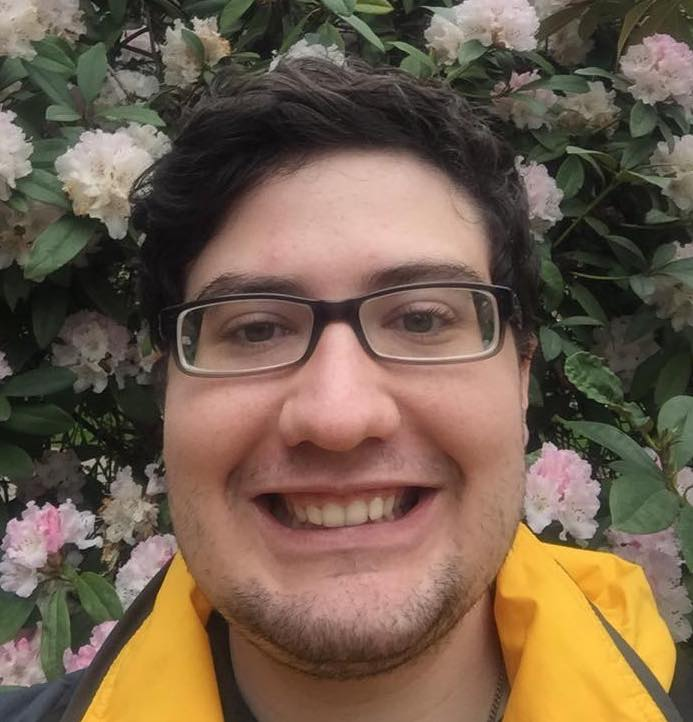

```{css, echo=FALSE}
.pagedjs_page:not(:first-of-type) {
  --sidebar-width: 0rem;
  --sidebar-background-color: #ffffff;
  --main-width: calc(var(--content-width) - var(--sidebar-width));
  --decorator-horizontal-margin: 0.2in;
}
```

Aside
================================================================================


{width=100%}


Contact Info {#contact}
--------------------------------------------------------------------------------

- <i class="fa fa-envelope"></i> johnmichaelwojahn@gmail.com
- **ORCID** [0000-0002-5060-0798](https://orcid.org/0000-0002-5060-0798)
- **ResearchGate** [John_Wojahn](https://www.researchgate.net/profile/John_Wojahn)
- <i class="fa fa-github"></i> [github.com/wojahn](https://github.com/wojahn)
- <i class="fa fa-phone"></i> +1 208 340 8626

Skills {#skills}
--------------------------------------------------------------------------------

- <i class="fa fa-lightbulb-o"></i> **Research**: Reproducible Science, Phylogenomics, Botany, Computational Biology
- <i class="fa fa-laptop"></i> **Programming**: ***Advanced:*** R (Software Developer), C/C++, RMarkdown, UNIX/LINUX; ***Intermediate:*** Bash, Python, Git, Clusters (Beowulf and SLURM), Keras, TensorFlow; ***Proficient:*** LaTeX, HTML
- <i class="fa fa-flask"></i> **Laboratory**: DNA/RNA Extraction, PCR, Angiosperm 353 Library Prep, DNA/RNA Quantification, Morphometry, Cultivation
- <i class="fa fa-comments"></i> **Languages**: English, French


Main
================================================================================

John M. A. Wojahn {#title}
--------------------------------------------------------------------------------

### My research interests are in the fields of phylogenomics, evolutionary plant biology, adaptive capacity, and bioinformatics.


Education {data-icon=graduation-cap data-concise=true}
--------------------------------------------------------------------------------

### Doctor of Philosophy

Ecology, Evolution, and Behavior <br> *Emphasis in Global Change Biology*

Boise, Idaho, USA

Present - 2020

Boise State University

Doctoral Advisors: Sven Buerki (Primary), Martin W. Callmander

Committee: James Smith and Stephen Novak

Dissertation: Phylogenomics of *Pandanus* Park. (Pandanaceae)


### Master of Science

Biology <br> *Emphasis in Plants*

Boise, Idaho, USA

2020 - 2018

Boise State University

Major Advisor: Sven Buerki

Committee: James Smith and Stephen Novak

Thesis: A metanalysis of sequences of vascular plants in the world’s biodiversity hotspots with a special section on Madagascar

### Honors Bachelor of Science

Marine Biology

Corvallis, Oregon, USA

2016 - 2011

Oregon State University

Honors Advisor: Byron C. Crump

Committee: Fiona Tomas Nash and Ryan Mueller

Thesis: Metagenomics and metatranscriptomics of the leaf-and root-associated microbiomes of *Zostera marina* and *Zostera japonica*

*Minors in French and Chemistry*

### Honors Bachelor of Science

Microbiology

Corvallis, Oregon, USA

2016 - 2011

Oregon State University


Peer-Reviewed Publications {data-icon=file-text}
--------------------------------------------------------------------------------

### Update on the phylogenetic framework of Malagasy angiosperms

In S. M. Goodman (ed.), The new natural history of Madagascar, pp. 464-470. <br> Princeton University Press. https://doi.org/10.2307/j.ctv2ks6tbb.58

Princeton, New Jersey, USA

2022

**Wojahn JMA**, Callmander MW, Lowry PP, Buerki S


### Sapindaceae

In S. M. Goodman (ed.), The new natural history of Madagascar, pp. 685-690. <br> Princeton University Press. https://doi.org/10.2307/j.ctv2ks6tbb.84

Princeton, New Jersey, USA

2022

Buerki S, Philipson P, Lowry PP, **Wojahn JMA**, Andriambololonera S, Callmander MW

### Meta-Analysis Reveals Challenges and Gaps for Genome-to-Phenome Research Underpinning Plant Drought Response 

Int. J. Mol. Sci. 2022, 23(20), 12297 https://doi.org/10.3390/ijms232012297

Basel, Switzerland

2022

Melton AE, Galla SJ, Dumanguit CD, **Wojahn JMA**, Novak S, Serpe M, Martinez P, Buerki S


### G2PMineR:A Genome to Phenome Literature Review Approach

Genes. 12:293 https://doi.org/10.3390/genes12020293

Basel, Switzerland

2021

**Wojahn JMA**, Galla SJ, Melton AE, Buerki S

### Metatranscriptomics and amplicon sequencing reveal mutualisms in seagrass microbiomes

Frontiers in Microbiology. 2018 9:388 https://doi.org/10.3389/fmicb.2018.00388

Lausanne, Switzerland

2018

Crump BC, **Wojahn JMA**, Tomas F, Mueller RS


Research Experience {data-icon=lightbulb-o}
--------------------------------------------------------------------------------

### Doctoral Research

Boise State University, Sven Buerki's Lab (In-Person); Conservatoire et Jardin botaniques de Genève, Martin W. Callmander's Lab (Remote)

Boise, Idaho, USA; Geneva, Switzerland

Present - 2020

- Investigating the evolutionary history of *Pandanus*


### EPSCoR Graduate Research Assistant

Boise State University, Sven Buerki's Lab

Boise, Idaho, USA

2022 - 2020

- Provider of bioinformatics programming support for the GEM3 project in Sven Buerki's lab
- Developed bioinformatics tools for the GEM3 community


### Master of Science Research

Boise State University, Sven Buerki's Lab

Boise, Idaho, USA

2020 - 2017

- Investigated the reproducibility of collections and DNA sequences in biodiversity hotspots
- Went on expedition to Madagascar with Sven Buerki to survey forest

### Undergraduate Research Assistant

Oregon State University, Byron Crump's Lab

Corvallis, Oregon, USA

2016 - 2013

- Investigated the microbiome of *Zostera marina* and *Zostera japonica*
- Collected samples on research cruises off the Oregon coast, on the Columbia River, and in the Arctic Ocean


### Undergraduate Research Intern

Oregon Department of Fish and Wildlife, Fish Health Services, Leslie Lindsay's Lab

Corvallis, Oregon, USA

Winter 2012

- Dissected juvenile Pacific Salmon to remove kidneys for ELISA analysis

### Undergraduate Research Intern

Oregon State University Hatfield Marine Science Center, Itchung Cheung's Lab

Newport, Oregon, USA

Spring 2012 - Winter 2011

- Enumerated fish eggs


Teaching Experience {data-icon=apple}
--------------------------------------------------------------------------------

### Teaching Assistant, Doctoral

Introductory Cell and Molecular Biology Lab Instructor at Boise State University

Boise, Idaho, USA

Present - 2022


### Designed and Implemented G2PMineR Lab Section

Developed a new lab section for BIOL 304 Evolution and Ecology course at Boise State University based on the G2PMineR literature review package that will be made publicly available on the GEM3 website. Supervised by Sarah Dalrymple and implemented by Leonora Bittleston.

Boise, Idaho, USA

2021-2023

### EPSCoR GEM3 Summer Academic Research Experience Mentor

Instructor of R and Laboratory Techniques for EPSCoR GEM3 Summer Academic Research Experience (SARE) Class at Boise State University

Boise, Idaho, USA

Summer 2021

### Vertically Integrated Projects Mentor

Instructor of R and Data Mining Techniques for Sven Buerki's Vertically Integrated Projects (VIP) course at Boise State University

Boise, Idaho, USA

Spring 2021

### EPSCoR Research Technician 2/Bioinformatics Instructor

Instructor of R and Data Mining Techniques for Summer Academic Research Experience (SARE) Class at Boise State University

Boise, Idaho, USA

Summer 2020


### Teaching Assistant, Masters

Introductory Cell and Molecular Biology Lab Instructor at Boise State University

Boise, Idaho, USA

2020 - 2018

### Teaching Assistant, Undergraduate

Assisted in teaching introductory French to 7th grade students at Cheldelin Middle School

Corvallis, Oregon, USA

2015 - 2013


Grants {data-icon=money}
--------------------------------------------------------------------------------

### University Honors College DeLoach Work Scholarship

Oregon State University

Corvallis, Oregon, USA

2014

- $1000

Awards and Honor Societies {data-icon=star}
--------------------------------------------------------------------------------

### Dean's Scholar, College of Arts and Sciences

Won the Dean's Scholar prize for the 2024 Graduate Showcase.

Boise, Idaho, USA

2024


### Fellow of the Linnean Society of London

A learned society dedicated to the study and dissemination of information concerning natural history, evolution, and taxonomy, founded in 1788.

Burlington House, Piccadilly, London, UK

Elected 2024

### Full Member of Sigma Xi (ΣΞ) 

Scientific Research Honor Society, founded in 1886.

Research Triangle Park, North Carolina, USA

Elected 2023

Posters, Presentations, and Conferences {data-icon=chalkboard-teacher}
--------------------------------------------------------------------------------
### Plastome phylogenetic analysis of Pandanus Parkinson: insights into adaptations and taxonomic recommendations

Poster for 2024 BSU Graduate Showcase

Boise, Idaho, USA

2024

**Wojahn JMA**, Callmander MW, Smith JF, Novack S,  Pierce J, Buerki S


### Bi-Organellar Phylogenomics of Pandanus (Pandanaceae) Sheds New Light into a Future Improved Infrageneric Classification and Ecological Processes

Poster for 2023 BSU Graduate Showcase

Boise, Idaho, USA

2023

**Wojahn JMA**, Callmander MW, Smith JF, Novack S, Buerki S

### Research and classroom implementation of G2PMineR: a novel genome to phenome literature review approach

Poster for 2022 NSF EPSCoR GEM3 Annual Meeting

Boise, Idaho, USA

2022

**Wojahn JMA**, Dalrymple S, Bittleston L, Callmander MW, Buerki S

### Testing the Reproducibility of Collection and Sequencing Efforts for the Biodiversity Hotspot Flora and Producing a Phylogeny of the Pandanaceae to Assess Evolutionary Distinctiveness and Risk of Extinction

Poster for 2021 Graduate Proposal Showcase

Boise, Idaho, USA

2021

**Wojahn JMA**, Callmander MW, Smith J, Novack S, Buerki S


### G2PMineR: A genome to phenome literature review approach

Poster for 2020 GEM3 Annual Meeting

Boise, Idaho, USA

2020

**Wojahn JMA**, Galla SJ, Buerki S

### Developing a rapid plant community survey for use in biodiversity hotspots

Poster for the Forum on Biodiversity of Global Hotspots 

Boise, Idaho, USA

2018

**Wojahn JMA**, Buerki S

Diversity, Equity, and Inclusion {data-icon=group}
--------------------------------------------------------------------------------

### Out in Science, Technology, Engineering, and Mathematics (oSTEM) Global

Member of the Global chapter of oSTEM, a non-profit professional association for LGBTQ+ people in the STEM community.

Global

2024-ongoing

### Some woody plants of the Boise River/Algunas plantas leñosas del río Boise/Quelques plantes ligneuses de la rivière Boise

Wrote trilingual guide to some of the woody plants of the Boise River for a nature walk hosted by Project Scientia, a multilingual public science dissemination organization. <br> https://tinyurl.com/2s3pb26c

Boise, Idaho, USA

2023

### Summer Authentic Research Experience (SARE) Mentor

Mentored minority and first-generation undergraduates

Boise, Idaho, USA

Summer 2021


### Summer Authentic Research Experience (SARE) Mentor

Mentored minority and first-generation undergraduates

Boise, Idaho, USA

Summer 2020


### Plant Identification For People With Visual Impairments

Posted an accessible guide on plant identification for people with visual impairments <br> https://tinyurl.com/5ee7kp63

Boise, Idaho, USA

2019

### Out in Science, Technology, Engineering, and Mathematics (oSTEM) Oregon State University chapter

Undergraduate member of oSTEM@OSU, a non-profit student association for LGBTQ+ people in the STEM community.

Corvallis, OR, USA

2011-2016

Leadership {data-icon=user}
--------------------------------------------------------------------------------
### Member of the Student Advisory Board for Inclusive Leadership

Served on the Student Advisory Board for Inclusive Leadership paid for by the NSF GOLD-EAGER grant, representing the Department of Biological Sciences.

Boise, Idaho, USA

2024

### President

Events & Research Association

Boise, Idaho, USA

Fall 2023

Club to foster professional, social, and scholarly development among advanced undergraduate and graduate students primarily of the Anthropology, Biology, BMOL (Biomolecular Sciences), EEB (Ecology, Evolution, and Behavior), Geosciences, and HES (Human Environment Systems) programs at Boise State University.

### Vice President

Ecological Research Association

Boise, Idaho, USA

2019-2020

Department of Biological Sciences graduate student social and professional development association


Software Products {data-icon=laptop}
--------------------------------------------------------------------------------

### NESS

The Nexus for Empowered Student Societies (NESS) is a forum aims to provide a space for officers of student-led organizations to share their insights in posts called "Nessies". 

[Link here](https://nessforum.wixsite.com/ness "NESS")

Boise, Idaho, USA

2024

### Muddiest Points AnalyzeR Webtool

Muddiest Points AnalyzeR uses heuristics and random sampling to create an input file of muddiest points that a generative artificial intelligence (such as ChatGPT) can parse and synthesize into a list. The input file is not human-readable but is machine-readable. ChatGPT has a character limit that is based on the complexity of the query it is being asked. Muddiest Points AnalyzeR creates a response whose word limit is below that warranted by its complexity, as estimated through trial and error.  
[Link here](https://xylem.shinyapps.io/muddiestpointsanalyzer/ "muddiestpointsanalyzer")

Boise, Idaho, USA

2024

### G2PMineR

A free and open-source literature mining tool developed specifically for G2P research. <br>This R package uses automation to make the G2P review process efficient <br>and unbiased, while also generating hypothesized associations <br> between genes and phenotypes within <br> a taxonomical framework. 
[Link here](https://buerkilabteam.github.io/G2PMineR_Web/index.html "G2PMineR")

Boise, Idaho, USA

ongoing-2021

### SoilsSeeR

SoilSeeR: An R Package to Easily Access the FAO-UNESCO Digital Soil Map of the World (0.1.0). Zenodo. https://doi.org/10.5281/zenodo.11068926

Boise, Idaho, USA

2022

### Kew_WCoUP_ProcessoR

An R package that extracts and sorts information from the "Kew World Checklist <br> of Useful Plants", which is available only in PDF format.
[Link here](https://github.com/wojahn/Kew_WCoUP_ProcessoR "Kew_WCoUP_ProcessoR")

Boise, Idaho, USA

2022

### MyLab Suite 

An automatic lab manager program (written in R Shiny) and a digital lab notebook <br> program (written in C). Available, but not maintained and may no longer be stable.

Boise, Idaho, USA

2018

Certifications {data-icon=check}
--------------------------------------------------------------------------------

### Boating Safety Certificate (Boating License)

Commonwealth of Massachusetts

Manchester-by-the-Sea, Massachusetts, USA

2021

Approved by NASBLA, USCG, and Transport Canada, valid in USA and Canada

### Multi-Passenger Van Training 

Boise State University

Boise, Idaho, USA

2018

### Notary Public Training

Secretary of State, State of Idaho

Boise, Idaho, USA

2017


### DAN Oxygen First Aid for Scuba Diving Injuries

Certified by Divers Alert Network

Boise, Idaho, USA

2011

### EFR-Primary Care (CPR) & Secondary Care (1st Aid)

Certified by Dive Magic, Inc.

Boise, Idaho, USA

2010


### American Red Cross Swimming Training

Instructor: Annie Endo

Misawa AFB, Aomori Prefecture, Japan

1998


Hobbies {data-icon=heart data-concise=true}
--------------------------------------------------------------------------------

### Pets

I have a dog (Chérie)

N/A

N/A


{width=20%}


### Guitar

Acoustic and Electric

N/A

N/A


### Bonsai

Member of the American Bonsai Society

Bristol, Indiana USA

N/A


### Drawing/Engraving

4th generation engraver

Manchester-by-the-Sea, Massachusetts, USA

N/A


### Costume Design and Construction

Design and sewing of partial or full-body costumes

Boise, Idaho, USA

N/A

### Tai Chi (Tàijíquán)

Yang style, taught by R. R. Carper

Corvallis, Oregon, USA

N/A
